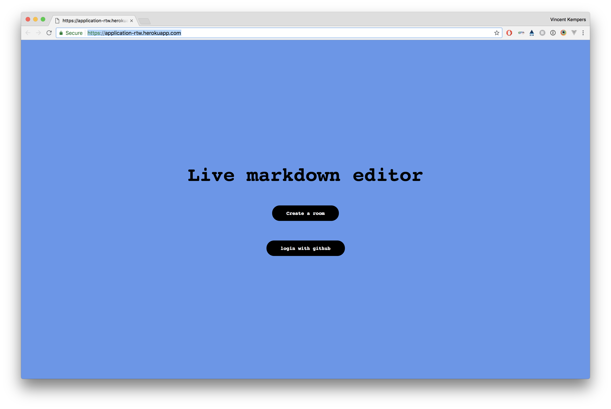

<h1 align="center">Real Time Markdown Editor</h1>

<div align="center">
  :globe_with_meridians::pushpin::bike: 
</div>
<div align="center">
  <strong>A real-time Markdown renderer for everyone!</strong>
</div>
<br />

---

## real-time-web-project



[Link to the project](https://application-rtw.herokuapp.com/)

---

## Table of contents

- [How to install](#how-to-install)
- [Features](#features)
- [How does this work.](#how-does-this-work.)
- [Services](#services)
- [Authentication](#thinking-about-authentication)
- [Api](#api)
- [Connection](#connection)
- [@TODO](#todo)
- [Wishlist](#wishlist)
- [License](#license)

# How to install

- First clone the repo :thumbsup:
- To install `npm install`
- to run in development `npm run dev`
- To start `npm start`
- the server listens to `localhost:7008`

# Features
The following features are/will be added to application:

### Added
* Show markdown in the editor.
* Markdown renderer.
* Login to save to database. 
* store the latest version in the database though a button.
* Sort of implementation of rights. (if you are logged in you can save)
* Unique id in the rooms.
* Show the changes of the server and client.
* Send the latest version to the client.
* Real time connection so two people can edit.

### Still needs to be added
* Some styling
* A better version of tunneling.
* 

# How does this work.


# Services

- [Socket.io](https://socket.io/)
- [Expressjs](https://expressjs.com/)
- [shortid](https://github.com/dylang/shortid)
- [Markedjs](https://github.com/markedjs/marked)
- [Google diff match patch](https://github.com/google/diff-match-patch)
- [Google diff match patch NPM package](https://github.com/JackuB/diff-match-patch)
- [Offline.js](https://github.hubspot.com/offline/docs/welcome/)

# Thinking about authentication

[simple authentication in NodeJS](https://danialk.github.io/blog/2013/02/20/simple-authentication-in-nodejs/)

[Github API Oauth](https://developer.github.com/apps/building-oauth-apps/authorizing-oauth-apps/)

<!-- What external data source is featured in your project and what are its properties 🌠 -->

# API
[Github API Getting Started](https://developer.github.com/apps/building-oauth-apps/authorizing-oauth-apps/)

The github api is being called though the node package [request](https://www.npmjs.com/package/request).

```JS
// start request
request(options, function(err, resp, body) {
		if (body) {
      // parse the response to json
			let parsedBody = JSON.parse(body);
      /* 
        The return (and head) will be used to get the second part of the call. What we are getting out of the call is a code.
       */
			options_user = {
				method: 'GET',
				url: config.user_url + '?access_token=' + parsedBody.access_token,
				headers: { accept: 'application/json', 'User-Agent': 'custom' },
			};
    }
         /* 
        We use the code in the first call to retrieve the unique access and use the data we need..
       */
		request(options_user, function(err2, resp2, body2) {
			if (body2) {
				let parsedBody2 = JSON.parse(body2);
				req.session.username = parsedBody2.login;
				res.redirect('/overview');
			}
		});
	});
});
```
# Connection

```
io.on('connection', (socket) => {
  // Socket Connection

  })
});
```

<!-- Where do the 0️⃣s and 1️⃣s live in your project? What db system are you using?-->

# TODO

<!-- Maybe a checklist of done stuff and stuff still on your wishlist? ✅ -->
* [x] Setup the server.
* [ ] Add marked package
* [ ] show input data parsed on the page
* [ ] Add a socket.io
* [ ] Add shortid
* [ ] Connect the 
* [ ] Stuff to do
* [ ] Stuff to do
* [ ] Stuff to do
* [ ] Stuff to do
* [ ] Stuff to do


# Wishlist


# License
<!-- How about a license here? 📜 (or is it a licence?) 🤷 -->


[MIT](https://opensource.org/licenses/MIT)
