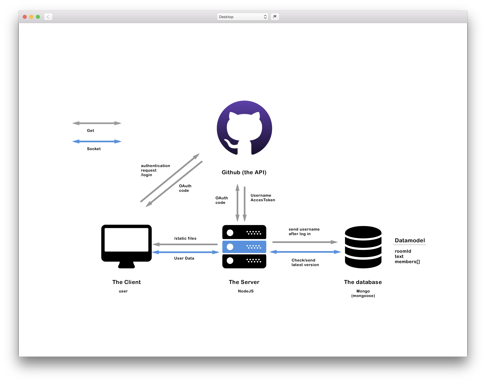

<h1 align="center">Real Time Markdown Editor</h1>

<div align="center">
  :globe_with_meridians::pushpin::bike: 
</div>
<div align="center">
  <strong>A real-time Markdown renderer for everyone!</strong>
</div>
<br />


# real-time-web-project


# How does this work.
This is an application that focuses on collaboration on one file. Users can edit the same file and see their work being rendered in markdown. This file will be stored on the database when you are logged in through [Github](https://github.com). When you save the file it will be stored on the database.


[Link to the project](https://application-rtw.herokuapp.com/)

---

## Table of contents

- [How to install](#how-to-install)
- [Features](#features)
- [How does this work.](#how-does-this-work.)
- [Services](#services)
- [Authentication](#thinking-about-authentication)
- [Api](#api)
- [Connection](#connection)
- [@TODO](#todo)
- [Wishlist](#wishlist)
- [License](#license)

# How to install

- First clone the repo :thumbsup:
- To install `npm install`
- to run in development `npm run dev`
- To start `npm start`
- the server listens to `localhost:7008`

# Features
The following features are/will be added to application:

### Added
* Show markdown in the editor.
* Markdown renderer.
* Login to save to database. 
* store the latest version in the database though a button.
* Sort of implementation of rights. (if you are logged in you can save)
* Unique id in the rooms.
* Show the changes of the server and client.
* Send the latest version to the client.
* Real time connection so two people can edit.

### Still needs to be added
* Some styling
* A better version of tunneling.
* A view of all the markdown files used.
* Something happening when the server is down.
* send the latest version.


# Services

- [Socket.io](https://socket.io/)
- [Expressjs](https://expressjs.com/)
- [shortid](https://github.com/dylang/shortid)
- [Markedjs](https://github.com/markedjs/marked)
- [Google diff match patch](https://github.com/google/diff-match-patch)
- [Google diff match patch NPM package](https://github.com/JackuB/diff-match-patch)
- [Offline.js](https://github.hubspot.com/offline/docs/welcome/)
- [Bodyparser](https://www.npmjs.com/package/body-parser)
- [Mongoose](http://mongoosejs.com/docs/index.html)
- [express-sessions](https://github.com/expressjs/session)

# Thinking about authentication

[simple authentication in NodeJS](https://danialk.github.io/blog/2013/02/20/simple-authentication-in-nodejs/)

[Github API Oauth](https://developer.github.com/apps/building-oauth-apps/authorizing-oauth-apps/)


# API
I use the the Github API to make the authentication possible. ([Github API Getting Started](https://developer.github.com/apps/building-oauth-apps/authorizing-oauth-apps/).)
 My knowledge of authentication and sending it through, and keeping a session alive. Was a big hurdle.

The github api is being called though the node package [request](https://www.npmjs.com/package/request).

```JS
// start request
request(options, function(err, resp, body) {
		if (body) {
      // parse the response to json
			let parsedBody = JSON.parse(body);
      /* 
        The return (and head) will be used to get the second part of the call. What we are getting out of the call is a code.
       */
			options_user = {
				method: 'GET',
				url: config.user_url + '?access_token=' + parsedBody.access_token,
				headers: { accept: 'application/json', 'User-Agent': 'custom' },
			};
    }
         /* 
        We use the code in the first call to retrieve the unique access and use the data we need..
       */
		request(options_user, function(err2, resp2, body2) {
			if (body2) {
        let parsedBody2 = JSON.parse(body2);
        // Get the account username to store it in the database. When it's being saved the database knows who it was.
				req.session.username = parsedBody2.login;
				res.redirect('/overview');
			}
		});
	});
});
```
# Connection
With the use of socket.io connections i could create rooms and emit the first "stored" tekst to the right room. I did that the following way.
```JS
io.on('connection', function(socket) {
  // on console user connects
	console.log('user connects');

	// here socket on en dan join room
	socket.on('joinRoom', function(room) {
		// Create emptry key value pair in contentsofRooms
		// contentsOfRooms[room] = '# welcome to the markdown editor';
		// on joining room send latest texts

		// emit to room with new stuff
		socket.join(room).emit('invigorateFirstText', contentsOfRooms[room]);
	});
	

	// user disconnects
	socket.on('disconnect', () => {
		console.log('user disconnected');
	});
});
```

When i created a room and knew it worked. I needed to show the data that was generated. But when two people are typing i didn't want one version to be leading. So i used [Google diff-patch-match](https://github.com/google/diff-match-patch) to make that a lot easier. **First** you need to know the diffrences, **then** you need to patch the original with the differences. **When** you have the patch then you can apply your changes. When done send the data to the client so it can update the view of input.
```JS
// emit something
	socket.on('my other event', data => {
		const textToCheck = contentsOfRooms[data.roomId] ? contentsOfRooms[data.roomId] : '';
		const diffs = dmp.diff_main(textToCheck, data.markedTekst);
		const patch = dmp.patch_make(textToCheck, diffs);
		const updatedTekst = dmp.patch_apply(patch, textToCheck);

		contentsOfRooms[data.roomId] = updatedTekst[0];

		// Emit the updatedtext and broadcast to room
		io.to(data.roomId).emit('updatedTekst', contentsOfRooms[data.roomId]);
	});

```

# Data life cycle
This shows the communication between the major components of the app.


About the authorization process. I wanted to know if the user is logged in so it can store on the server. I don't want any random person add "files" to the database. So if you aren't logged in this functionality will not be available.

# Deployment

Deployed the app via [Heroku](https://www.heroku.com). I made use of the [heroku CLI](https://devcenter.heroku.com/articles/heroku-cli) and went through the steps of deploying your first app.

_Following these steps (assuming you already work from a github repo):_
1. `heroku login` to login to your heroku.
2. You need the web application to setup a app (this is a better way because you can set up the region of the server).
3. When that is setup commit and push to your git. So there aren't commits open.
4. You will see in the dashboard app: `heroku git:remote -a your-app-name`
5. when that did it's thing. To deploy => `git push heroku master`
6. It will log out a link `https://your-app-name.herokuapp.com`


# TODO

<!-- Maybe a checklist of done stuff and stuff still on your wishlist? ✅ -->
* [x] Setup the server.
* [x] Add marked package
* [x] show input data parsed on the page
* [x] Add a socket.io
* [x] Add shortid
* [x] Create rooms with a unique shortid URL.
* [x] Write the same time without overwriting eachother.
* [x] Initializing Google diff match patch.
* [x] Storing data on the server.
* [x] Connecting with the Github API.
* [x] Recieving the data from the Github API.
* [x] Learning how express-sessions work.
* [x] send data through sessions.
* [x] Database setup.
* [x] Mongoose initialize and create a schema.
* [x] When data is created send to the database.
* [x] When the user is logged in "saving.." should be enabled.
* [x] When the user presses the save button the data should be send and stored on the database.
* [x] When the save redirects you back you should see the contents that has been stored on the server.
* [x] Core functionality works


# Wishlist
- [ ] More styling.
- [ ] A view of all the content that you have saved.
- [ ] A way to work simultaniously with **two** cursors.
- [ ] Authentication will show your image and name.
- [ ] A way to show the list of users that are logged in and not logged in.
- [ ] Database stores of multiple sessions, this should be 1 store of 1 save.
- [ ] Probably redo the database setup to make it more fail proof.

# License
<!-- How about a license here? 📜 (or is it a licence?) 🤷 -->


[MIT](https://opensource.org/licenses/MIT)
